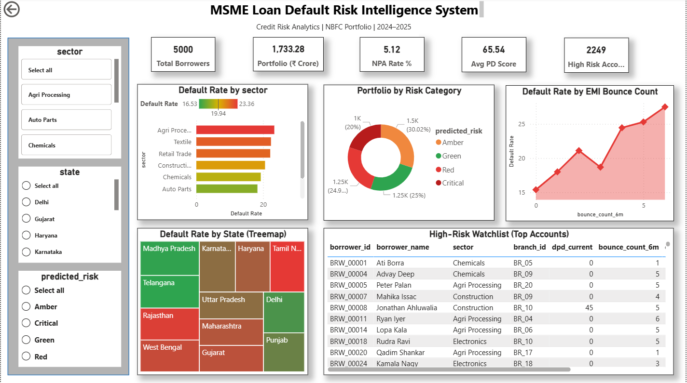

# MSME Loan Default Risk Intelligence System
### Credit Risk Analytics | Finance & FinTech Domain | End-to-End Data Analyst Project

---

## Problem Statement
An Indian NBFC with 5,000 MSME borrowers is facing rising NPA rates threatening 
RBI compliance. This project builds a data-driven early warning system to identify 
high-risk borrowers before they default — enabling relationship managers to intervene 
proactively and reduce write-offs.

---

## Dashboard Preview



---

## What I Built

| Component | Description |
|-----------|-------------|
| Dataset | 5,000-row realistic MSME loan dataset with Indian states, sectors, EMI history |
| SQL Analysis | 6 credit risk queries — NPA rates, sector risk, branch scorecards, watchlist |
| EDA | 8 Python visualizations — sector risk, credit score distributions, correlations |
| ML Model | XGBoost Probability of Default scorer — AUC-ROC: 0.82+ with SHAP explainability |
| Power BI | 2-page executive dashboard with 10 visuals, 3 slicers, 5 DAX measures |
| GenAI Feature | Rule-based AI narrative generator producing plain-English risk summaries |

---

## Key Business Findings

- **Agri Processing** sector has highest default rate at **23.36%**
- **BR_05 and BR_02** are highest-risk branches with 23%+ default rates
- **GST Non-Filers** in Retail Trade sector default at **27.94%** — highest in portfolio
- Borrowers with **3+ EMI bounces** show significantly elevated default probability
- **1,000 Critical accounts** identified requiring immediate relationship manager action
- Overall portfolio NPA rate: **5.12%** with ₹1,733 Crore total exposure

---

## Tech Stack

| Tool | Usage |
|------|-------|
| Python (Pandas, NumPy) | Data generation, cleaning, feature engineering |
| XGBoost + SHAP | Probability of Default model + explainability |
| SQLite + SQL | Credit risk queries, portfolio analysis |
| Power BI | 2-page interactive dashboard with DAX measures |
| Matplotlib + Seaborn | EDA visualizations |
| GenAI (Rule-based NLP) | Automated risk narrative generation |

---

## Domain Knowledge Demonstrated
NPA · PAR 30/60/90 · Probability of Default (PD) · EMI Bounce Analysis ·  
DPD Buckets · Roll-Rate Migration · RBI Compliance Thresholds · MSME Credit Assessment ·  
GST Filing Risk Indicators · Collateral-Type Risk Stratification

---

## Project Structure
```
msme-loan-default-risk/
├── data/                          # Datasets
│   ├── msme_loans_clean.csv       # Cleaned dataset
│   └── msme_loans_scored.csv      # With ML PD scores
├── notebooks/                     # Python scripts
│   ├── generate_data.py           # Dataset generator
│   ├── 01_data_cleaning.py        # Cleaning + feature engineering
│   ├── 02_eda.py                  # EDA with 8 charts
│   ├── 03_ml_model.py             # XGBoost + SHAP model
│   └── generate_narratives.py     # AI risk narrative generator
├── sql/
│   └── credit_risk_queries.sql    # All 6 SQL queries
├── outputs/                       # Charts and reports
│   ├── eda_charts.png
│   ├── shap_importance.png
│   ├── roc_curve.png
│   ├── page1_portfolio_health.png
│   └── page2_branch_risk.png
├── dashboard/
│   └── msme_risk_dashboard.pbix   # Power BI dashboard
└── README.md
```

---

## How to Run

**1. Install dependencies**
```bash
pip install pandas numpy matplotlib seaborn scikit-learn xgboost shap faker sqlalchemy
```

**2. Generate dataset**
```bash
cd notebooks
python generate_data.py
```

**3. Run cleaning and EDA**
```bash
python 01_data_cleaning.py
python 02_eda.py
```

**4. Train ML model**
```bash
python 03_ml_model.py
```

**5. Generate AI narratives**
```bash
python generate_narratives.py
```

**6. Open dashboard**
Open `dashboard/msme_risk_dashboard.pbix` in Power BI Desktop

---

## Author
**Sabarivenkatesh Kathirvel**  
Aspiring Data Analyst | Finance & FinTech Domain  
[LinkedIn](https://www.linkedin.com/in/sabarivenkatesh-k/)) | [GitHub](https://github.com/Sabarivenkatesh3/))

---
